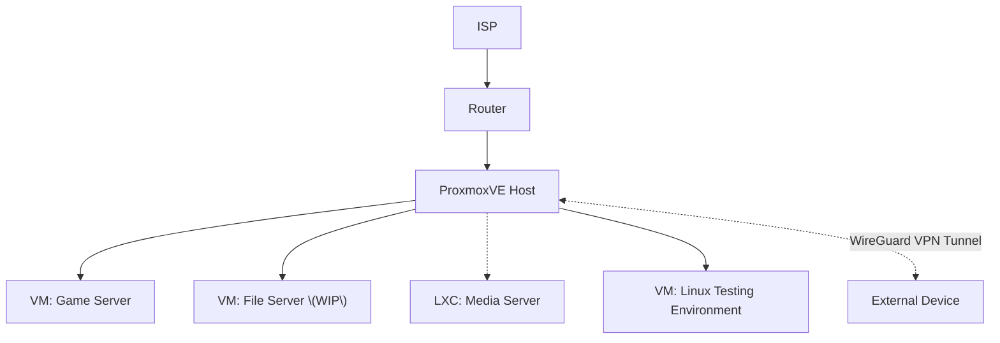

## Network Setup Diagram

```mermaid
graph TD
    A[ISP] --> B[Router]
    B --> C[ProxmoxVE Host]
    C --> D1["VM: Game Server"]
    C --> D2["VM: File Server \(WIP\)"]
    C -.-> D3["LXC: Media Server"]
    C --> D4["VM: Linux Testing Environment"]
    C <-.->|WireGuard VPN Tunnel| E[External Device]
```
